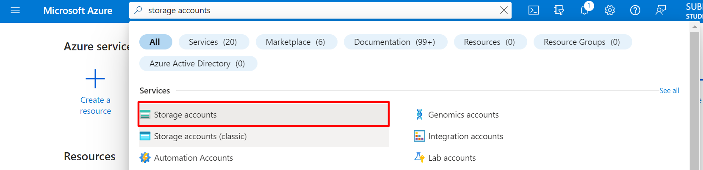
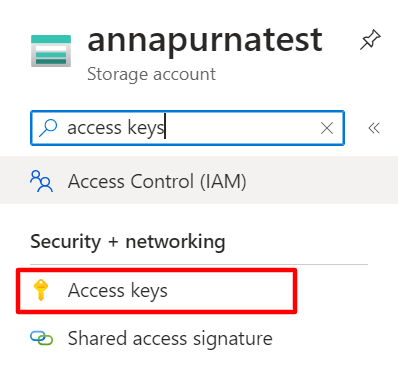
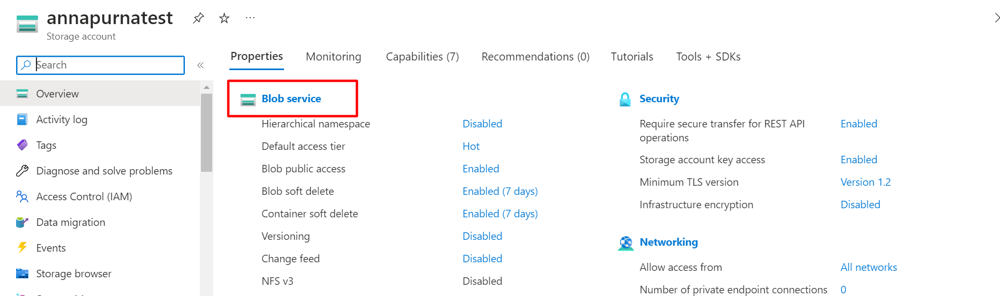

# Annapurna 🙌
Website: [Annapurna](https://project-annapurna.azurewebsites.net/)

   
  
  
  
   
  
  
  
   
  
  
  

# Food Donation Application 🤝

## Overview 🌟

This is a food donation application that connects NGOs and restaurants. The purpose of this platform is to enable restaurants to donate surplus food to people in need through partnering NGOs. The application includes features such as Google geocoding for location services 🌍, email OTP notifications ✉️ for secure authentication, and a contact us page 📞 for users to reach out with any inquiries or concerns.

Features 🚀

- **Restaurant Donation:** Restaurants can donate surplus food to NGOs through the platform.
- **NGO Partnership:** NGOs can receive food donations from restaurants and distribute them to people in need
- **Google Geocoding:** Integration with Google Geocoding API for accurate location services.
- **Email OTP Notifications:** Users receive One-Time Password (OTP) notifications via email for secure authentication. 
- **Contact Us Page:** Users can contact the support team or administration through the contact us page.
- **Authentication:** Implement authentication functionality to ensure secure access to the application's features and user data. This can include user registration, login, and session management, using techniques such as username/password or social media authentication. Authentication adds an extra layer of security and allows personalized user experiences within the platform.

## Configuring the .env file 

The following environment variable are necessary for configuring the project on your local - 

- **Azure:** You must have an azure storage account for the project. Images are stored as a **blob** in azure. So we need to have a blob container which we would access through our **access keys**

If you are a student then you can sign up for a $100 free credit on azure [here](https://azure.microsoft.com/en-in/free/students/)

After selecting the storage account. We need to create a new resource.

A form is displayed. You only need to fill the type of subscription and the name of storage account. Leave rest to default.

Then go to the resource and search for access keys.

There you will find **storage account name** and **connection string** (there are 2 of them, choose any one) 

As a final step in the resource page you have to setup the container where we would store the images.

In your newly created storage acc dashboard, click on the blob storage

You must see a page where you can create a new container. **Remember this name as we need it**

The env variable are - 

`CONTAINER_NAME = <your container name goes here>`  
`CONNECTION_STRING = <your connection string goes here>`

## Tech Stacks 💻

- **MongoDB:** NoSQL database used for storing and retrieving data.
- **Express:** Web application framework for building server-side applications.
- **Node.js:** Runtime environment for executing JavaScript code on the server.
- **EJS (Embedded JavaScript):** A templating engine that generates HTML markup with JavaScript.
- **JavaScript:** Programming language used for the application's logic and functionality.
- **HTML:** Markup language for creating the structure and content of web pages.
- **CSS:** Styling language for visually enhancing the user interface.

## Setup and Deployment ⚙️

To set up and deploy the application, follow these steps:

1. Clone the repository: `git clone <repository-url>`
2. Install dependencies: `npm install`
3. Configure environment variables for APIs and services.
4. Start the application: `nodemon index.js`
7.  Access the application in a web browser at `http://localhost:3000`. 
If you have any questions or need further clarification, please feel free to reach out. We appreciate your contribution to making the Food Donation Application a success!

# contributors 

  

**Thanks for the contribution** 

